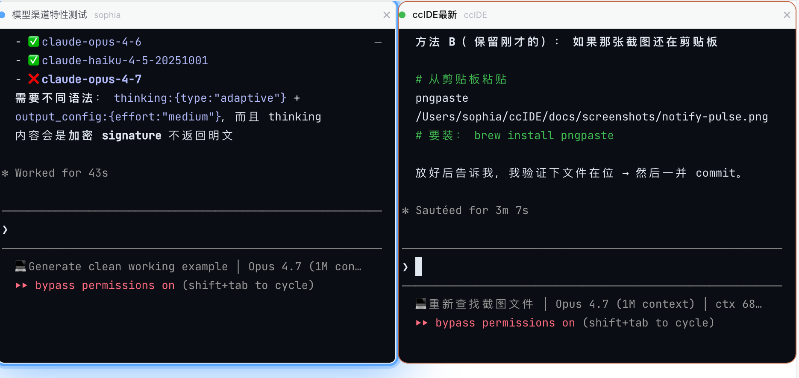
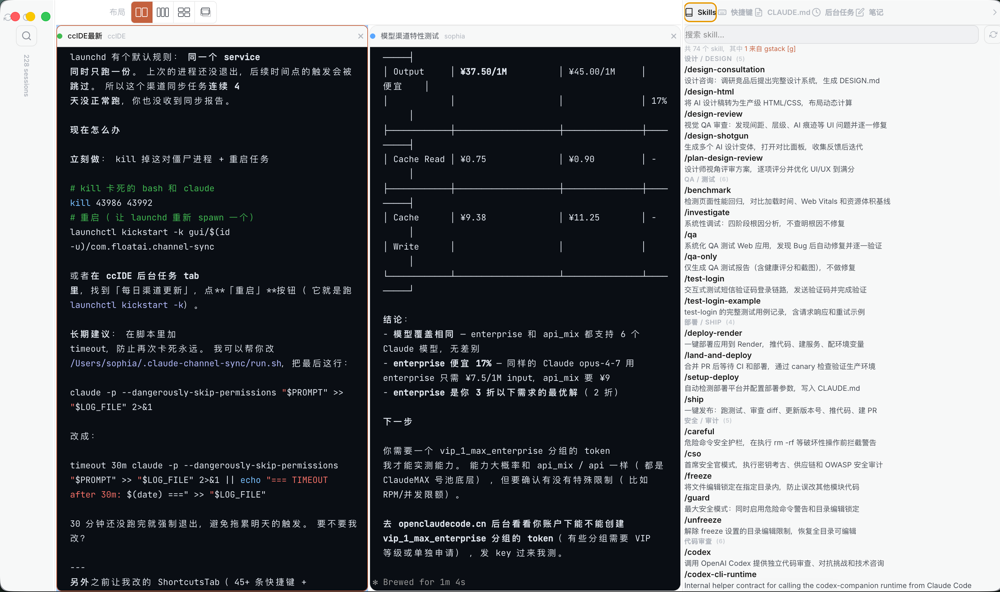
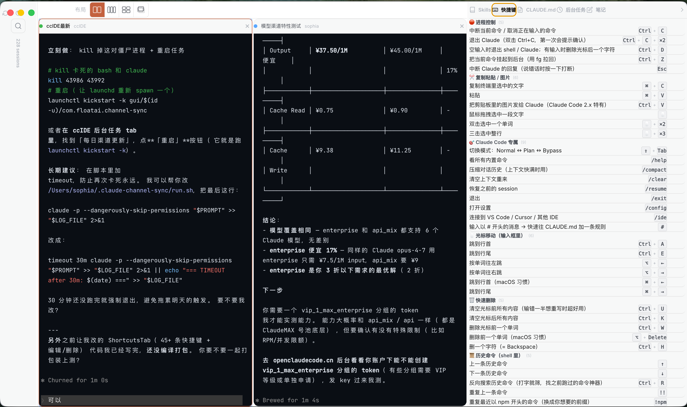
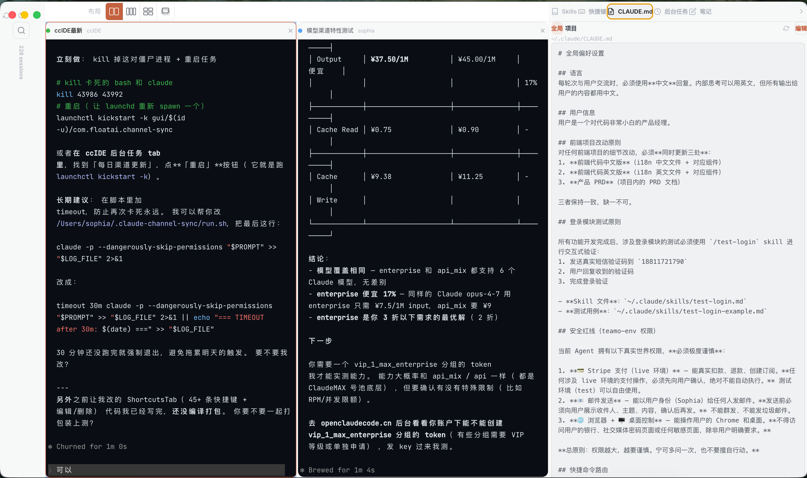
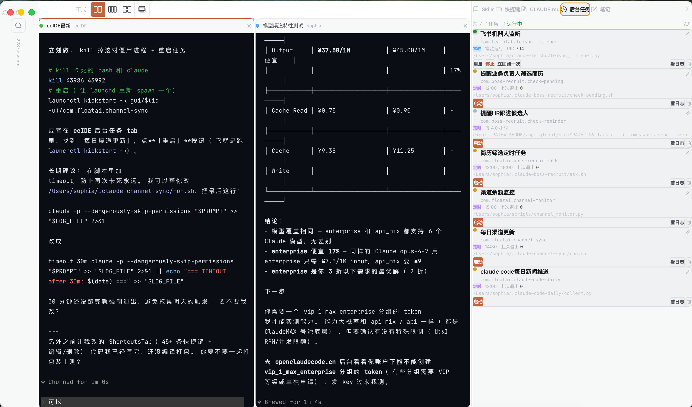
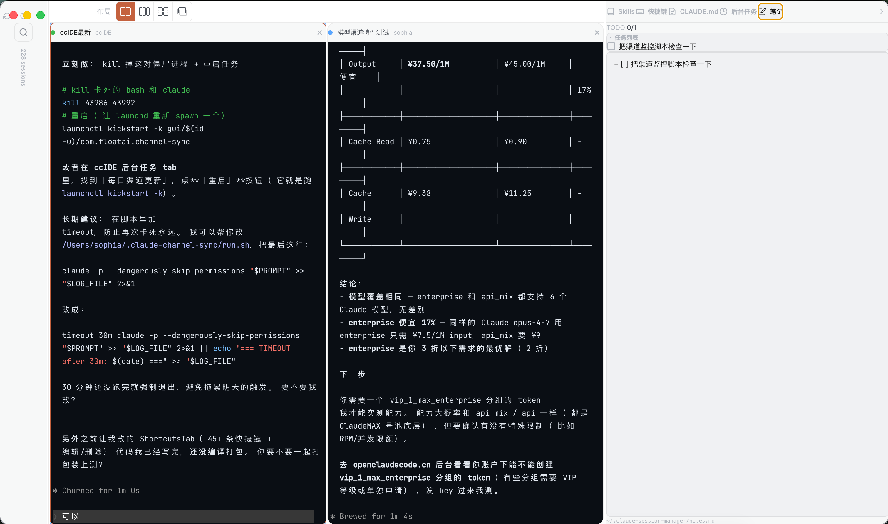

<div align="center">

# Awesome-ccIDE

**The missing IDE for your Claude Code sessions.**

Search any conversation. Resume in one click. Run multiple sessions side by side — with a built-in tool sidebar for skills, shortcuts, CLAUDE.md, background tasks, and notes.

[Download for macOS](https://github.com/sophiaashi/Awesome-ccIDE/releases/latest) &nbsp;&middot;&nbsp; [Report Bug](https://github.com/sophiaashi/Awesome-ccIDE/issues) &nbsp;&middot;&nbsp; [Request Feature](https://github.com/sophiaashi/Awesome-ccIDE/issues)

</div>


---

## The Problem

You have 100+ Claude Code sessions scattered across projects. You remember discussing "API rate limiting" somewhere last week, but which session was it? You `claude --resume` with a UUID you don't remember, in a directory you have to `cd` into first. When you finally get three sessions running, you're alt-tabbing between terminal windows — and you still have to jump to a separate editor every time you want to check which skill handles X or tweak your CLAUDE.md.

**ccIDE fixes all of this.**

## Features

### 🔍 Full-Text Search Across All Sessions

Type any keyword. ccIDE searches through every message you've ever sent to Claude — not just session titles, but the actual conversation history. Results show the exact sentence containing your keyword, highlighted in context. Sorts by the real `.jsonl` file mtime, so a session you touched 5 minutes ago always floats to the top (even if Claude's own index is stale).

### 🖱️ One-Click Resume

Click "Resume" on any session. It opens right inside ccIDE in an embedded terminal. No copying UUIDs. No `cd`-ing into directories. No opening Terminal.app. ccIDE reads the real `cwd` from the session's `.jsonl` so resume works even when Claude's own `sessions-index.json` has the wrong `projectPath`.

### 🖼️ Multi-Terminal Layouts

Run 2, 3, or 4 sessions simultaneously with built-in layouts:

| Layout | Description |
|--------|-------------|
| **Two Column** | Side-by-side split |
| **Three Column** | Triple split |
| **Quad Grid** | 2x2 grid |
| **Stack** | Overlapping tabs, switch between them like Chrome |


### 🏷️ Session Naming

Give your sessions memorable names. Double-click to rename. Search by name. Names are stored locally and persist across restarts.

### 🔵 Smart Terminal Notifications

Claude pauses after a long reply or asks for your input? The corresponding terminal **pulses in blue** so you know which session needs attention — even when you have 4 running in a quad grid. Powered by Claude Code's built-in `Stop` and `Notification` hooks (ccIDE auto-offers to install them on first launch).



### ⌨️ Keyboard-First

| Shortcut | Action |
|----------|--------|
| `Cmd + K` | Focus search |
| `↑ / ↓` | Navigate sessions |
| `Enter` | Resume selected session |
| `Cmd + 1 ~ 9` | Jump to terminal N |
| `Ctrl + Tab` | Next terminal (cycles) |
| `Ctrl + Shift + Tab` | Previous terminal |
| `Cmd + S` | Save CLAUDE.md (in edit mode) |

### 🛠️ Right-Side Tool Sidebar

Five tabs living alongside your terminals — everything you need without leaving the app. Collapses to a 40px rail when you need more terminal space.

#### 📚 Skills Browser

Scans `~/.claude/skills/` and `~/.claude/plugins/`, groups your installed skills into semantic categories so you can find what you need fast. Click any row to copy its `/skill-name` and paste straight into Claude.



#### ⌨️ Shortcuts Reference

A built-in library of terminal and Claude Code shortcuts, grouped by context (process control, copy/paste, Claude Code commands, cursor, delete, history, screen, ccIDE's own). Every row supports **edit / delete**, and you can add custom shortcuts — all persisted locally, and a one-click "restore defaults" if you regret your edits.



#### 📝 CLAUDE.md Editor

View and edit both your **global** (`~/.claude/CLAUDE.md`) and **per-project** (`<project>/CLAUDE.md`) instruction files without ever leaving ccIDE. Project tab follows your currently active terminal. `Cmd+S` to save, `Esc` to cancel.



#### 🕐 Background Tasks

Manages **launchd agents** under `~/Library/LaunchAgents/` — only your own (auto-filters system and vendor apps). Each row shows real-time status (🟢 running / 🟡 loaded / ⚪ unloaded), schedule description, PID, last exit code, and the script path. Operations: **start / stop / restart / kickstart / view logs / delete** — all one-click. Rename each task so future-you remembers what it does.



#### 📒 Notes with Inline TODO

Quick markdown scratchpad auto-saved to `~/.claude-session-manager/notes.md` (500ms debounce). Markdown checkboxes (`- [ ]` / `- [x]`) get rendered as a **clickable TODO list at the top** — click a task's text to jump the textarea to its source line.



## Install

### Download (Recommended)

1. Go to [**Releases**](https://github.com/sophiaashi/Awesome-ccIDE/releases/latest)
2. Download `ccIDE-1.0.0-arm64.dmg`
3. Open the DMG, drag ccIDE to Applications
4. Done

> Requires macOS on Apple Silicon (M1/M2/M3/M4). Intel build coming soon.

### Build from Source

```bash
git clone https://github.com/sophiaashi/Awesome-ccIDE.git
cd Awesome-ccIDE
npm install
npm run dist
# Built app is in release/mac-arm64/ccIDE.app
cp -R release/mac-arm64/ccIDE.app /Applications/
```

### One-Liner Install

```bash
curl -fsSL https://github.com/sophiaashi/Awesome-ccIDE/releases/latest/download/ccIDE-1.0.0-arm64.dmg -o /tmp/ccIDE.dmg && hdiutil attach /tmp/ccIDE.dmg -quiet && cp -R "/Volumes/ccIDE 1.0.0/ccIDE.app" /Applications/ && hdiutil detach "/Volumes/ccIDE 1.0.0" -quiet && rm /tmp/ccIDE.dmg && echo "ccIDE installed. Open from Launchpad or run: open /Applications/ccIDE.app"
```

## Prerequisites

- **macOS** (Apple Silicon)
- **Claude Code CLI** installed (`npm install -g @anthropic-ai/claude-code`)
- Existing Claude Code sessions (the app reads from `~/.claude/projects/`)

## How It Works

```
┌─────────────┐       ┌────────────────────┐       ┌──────────────┐
│  Session    │       │   Terminal Grid    │       │ Tool Sidebar │
│  List       │ ───► │ (quad/3-col/2-col/  │ ◄──── │ Skills       │
│             │ click │  stack layouts)    │       │ Shortcuts    │
│  Search     │resume │                    │       │ CLAUDE.md    │
│  Filter     │       │  xterm.js + pty    │       │ Tasks        │
│  Names      │       │                    │       │ Notes        │
└─────────────┘       └────────────────────┘       └──────────────┘
      │                         │                         │
      │ reads                   │ spawns                  │ reads/writes
      ▼                         ▼                         ▼
 ~/.claude/projects/      claude --resume <id>    ~/.claude/skills/
 */sessions-index.json    in project cwd          ~/.claude/CLAUDE.md
 *.jsonl (real cwd)                               ~/Library/LaunchAgents/
 ~/.claude/history.jsonl                          ~/.claude-session-manager/

       ▲
       │ Stop / Notification hooks
       │ (auto-installed on first launch)
       │
 Claude Code CLI ──► ccIDE local HTTP server (127.0.0.1:3458)
                     └─► IPC ─► terminal pulses blue
```

## Tech Stack

| Layer | Technology |
|-------|-----------|
| Shell | Electron |
| UI | React 19 + TailwindCSS |
| Terminal | xterm.js + node-pty |
| Search | In-memory index over `~/.claude/history.jsonl` |
| Notifications | Local HTTP server (127.0.0.1:3458) + Claude Code hooks |
| Design | Linear-inspired dark theme |
| Build | Vite + electron-builder |
| Code signing | Self-signed cert (stable across rebuilds, preserves TCC permissions) |

## Data & Privacy

- **100% local.** No data leaves your machine. No analytics. No telemetry.
- Reads from `~/.claude/projects/` (session metadata), `~/.claude/history.jsonl` (search index), `~/.claude/skills/`, `~/.claude/CLAUDE.md`, `~/Library/LaunchAgents/*.plist`
- Writes to `~/.claude-session-manager/session-names.json`, `task-names.json`, `notes.md`
- The notification HTTP server binds **only to 127.0.0.1** — unreachable from local network, cloud, or anywhere outside this machine
- No network requests except what Claude Code itself makes

## Contributing

PRs welcome. To develop locally:

```bash
git clone https://github.com/sophiaashi/Awesome-ccIDE.git
cd Awesome-ccIDE
npm install

# Dev mode (Vite HMR + Electron)
npm run electron:dev
```

## Roadmap

- [ ] Intel Mac support
- [ ] Linux support
- [ ] Session content preview (read conversation without resuming)
- [ ] Session tagging and filtering by tags
- [ ] Export session as markdown
- [ ] Auto-detect running Claude Code processes
- [ ] Homebrew cask install (`brew install --cask ccide`)
- [ ] Per-project notes (alongside global)
- [ ] Plugin API for third-party tool sidebar tabs

## License

MIT

---

<div align="center">

Built for people who talk to Claude all day.

**[Star this repo](https://github.com/sophiaashi/Awesome-ccIDE)** if ccIDE saves you time.

</div>
